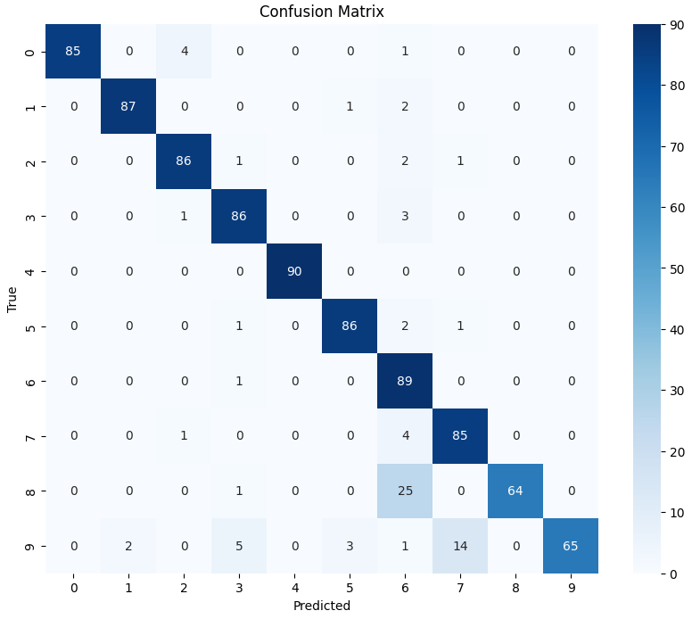
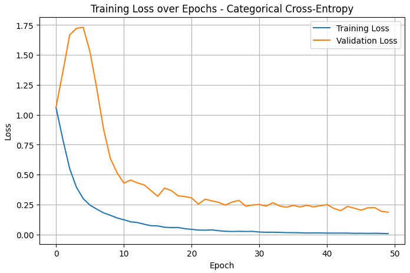
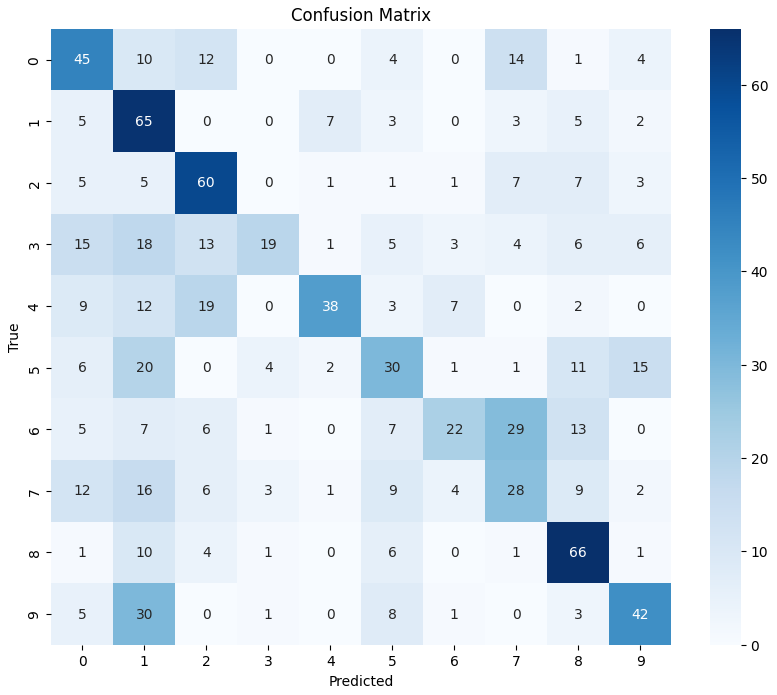

# artificial-immune-system-speech-classification
AIS Model Using Negative Selection for Multiclass Speech Classification to classify spoken audio digits.

A comparison between more traditional ways of classifying speech and unconventional ways, artificial immune systems.

## Confusion Matrix & Loss for the Deep Neural Network model evaluation
  

## Confusion Matrix for the Artificial Immune System evaluation

 

### Goals

The main goal of this research was to find new and novel ways to classify speech. Using artificial immune systems with a focus on a multi-class classification negative selection algorithm was used to classify speech spoken by different users.

The dataset that was used can be found here: https://github.com/Jakobovski/free-spoken-digit-dataset

